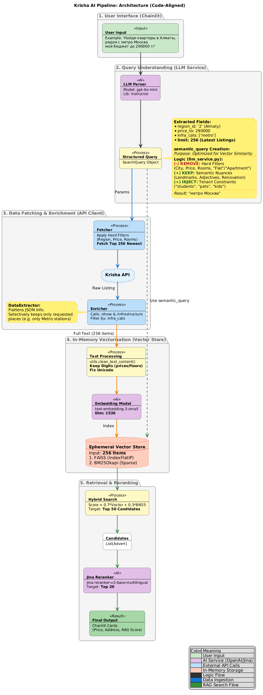

<p align="center">
  
</p>

<h1 align="center">Krisha AI</h1>

[](https://www.python.org/downloads/)
[](https://chainlit.io/)
[](https://opensource.org/licenses/MIT)

> Высокоточный RAG-пайплайн для семантического поиска в сфере недвижимости.

**Krisha AI** — это end-to-end RAG-решение, демонстрирующее применение современных LLM-технологий и асинхронной архитектуры для создания интуитивного поиска. Система декомпозирует запросы на естественном языке, динамически индексирует данные из внешних API и применяет многоступенчатое ранжирование для достижения высокой релевантности.

---

### Демонстрация


<p align="center">

https://github.com/user-attachments/assets/bfc9b840-525f-43cb-9eab-0db8559d7c5c

</p>

---

## Как это работает (Архитектура пайплайна)

Пайплайн спроектирован для работы с данными в реальном времени. Архитектура проекта построена на принципах чистоты и разделения ответственности (SoC), где бизнес-логика полностью отделена от слоев представления (UI).

<p align="center">
  
</p>

1.  **Парсинг запроса (LLM)**
    *   Пользовательский ввод (`"двушка в Алматы до 400к"`) преобразуется в строго типизированный `Pydantic`-объект с помощью `Instructor`.
    *   LLM разделяет запрос на **жесткие фильтры** (цена, регион) и **семантическое ядро** для векторного поиска (например, `"уютная, светлая, для семьи"`).

2.  **Сбор и обогащение данных**
    *   Асинхронный `httpx`-клиент запрашивает **256** последних объявлений, применяя жесткие фильтры.
    *   Каждое объявление обогащается полным описанием и данными об инфраструктуре, которые также проходят фильтрацию.

3.  **Динамический индекс "на лету"**
    *   Обогащенные тексты векторизуются моделью `text-embedding-3-small`.
    *   В памяти создается временный гибридный индекс: **FAISS** для семантики и **BM25** для точных совпадений ключевых слов.

4.  **Поиск и многоуровневое ранжирование**
    *   **Retrieval:** Гибридный поиск отбирает **топ-50** наиболее релевантных кандидатов из индекса.
    *   **Reranking:** Эти 50 кандидатов проходят через более точную модель `jina-reranker`, которая отсеивает шум и формирует финальный **топ-20** для пользователя.

## Ключевые технологии
- **LLM & Orchestration**: OpenAI (`gpt-4o-mini`), Instructor
- **Vector Search**: FAISS, `text-embedding-3-small`
- **Lexical Search**: `rank-bm25`
- **Reranking**: Jina AI (`jina-reranker-v2-base-multilingual`)
- **UI & Async**: Chainlit, `httpx`, `asyncio`
- **Data Validation**: Pydantic

## Структура проекта
Проект имеет модульную архитектуру с четким разделением слоев (interfaces, services, models), что упрощает его поддержку и расширение.

```text
Krisha-AI/
├── app.py              # Точка входа для Web UI (Chainlit)
├── main.py             # Точка входа для CLI
├── datasets/           # Тестовые данные и снепшоты
├── evaluation/         # Модуль для замера метрик качества (NDCG, MRR)
├── public/             # Статические файлы (иконки, стили, видео)
│
└── src/
    ├── config/         # Настройки Pydantic и кеша
    ├── interfaces/     # Слой представления (UI)
    │   ├── cli/        # Логика консольного интерфейса
    │   └── web/        # Логика Web-интерфейса (Chainlit)
    │
    ├── models/         # Pydantic-модели для данных
    │
    ├── services/       # Основная бизнес-логика
    │   ├── api_client.py
    │   ├── llm_service.py
    │   ├── reranker.py
    │   └── vector_store.py
    │
    └── utils/          # Вспомогательные утилиты
```

## Установка и запуск

### Через `uv` (Рекомендуется)
`uv` — это современный и очень быстрый менеджер пакетов для Python.

```bash
# 1. Клонировать репозиторий
git clone https://github.com/I3eka/Krisha-AI.git
cd Krisha-AI

# 2. Установить зависимости и создать окружение
uv sync

# 3. Настроить .env файл (на основе .env.example)

# 4. Запустить Web UI
uv run chainlit run app.py
```

### Альтернативный способ (`pip`)
```bash
# 1. Клонировать репозиторий
git clone https://github.com/I3eka/Krisha-AI.git
cd Krisha-AI

# 2. Создать и активировать виртуальное окружение
python -m venv venv
source venv/bin/activate

# 3. Установить зависимости
pip install -r requirements.txt

# 4. Запустить Web UI
chainlit run app.py
```

## Примечание
Этот проект является демонстрацией возможностей гибридного векторного поиска и современной архитектуры Python приложений. Автор не несет ответственности за использование данного ПО в коммерческих целях или с нарушением правил сторонних сервисов.

## License
MIT

---

<div align="center">

This project is a personal portfolio piece demonstrating RAG (Retrieval-Augmented Generation) capabilities in the Real Estate domain.

**© Bexultan, 2026. All Rights Reserved.**

The source code is available for educational purposes and inspection by potential employers only. Unauthorized copying, modification, distribution, or commercial use of this code is strictly prohibited.

*Note: This project is a proof-of-concept and interacts with third-party APIs for demonstration purposes only.*

</div>
